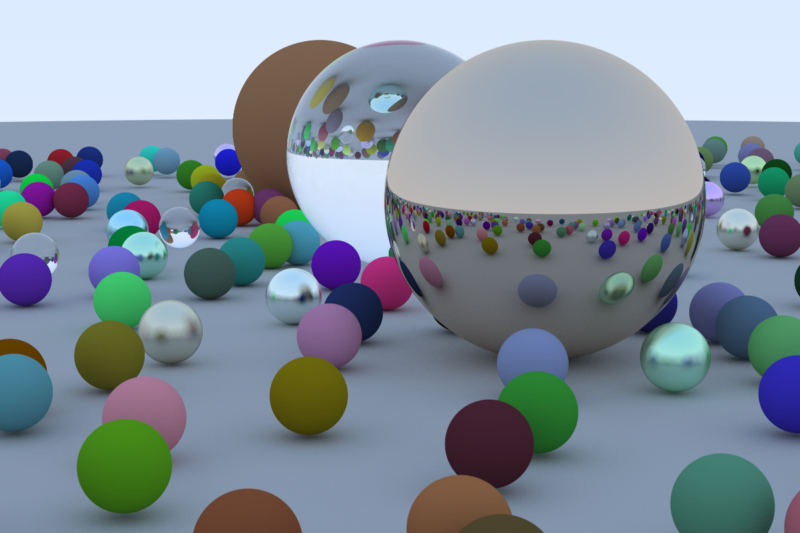

# Raytracing

Simple raytracing implementation in Rust!

Follows the tutorial from [Raytracing in a Weekend](https://raytracing.github.io/books/RayTracingInOneWeekend.html).

## Demo

This image was rendered with 500 samples per pixel with a maximum depth of 50 bounces. Took ~2hrs single threaded (~14mins with 10 threads) to render on my M1 Mac.